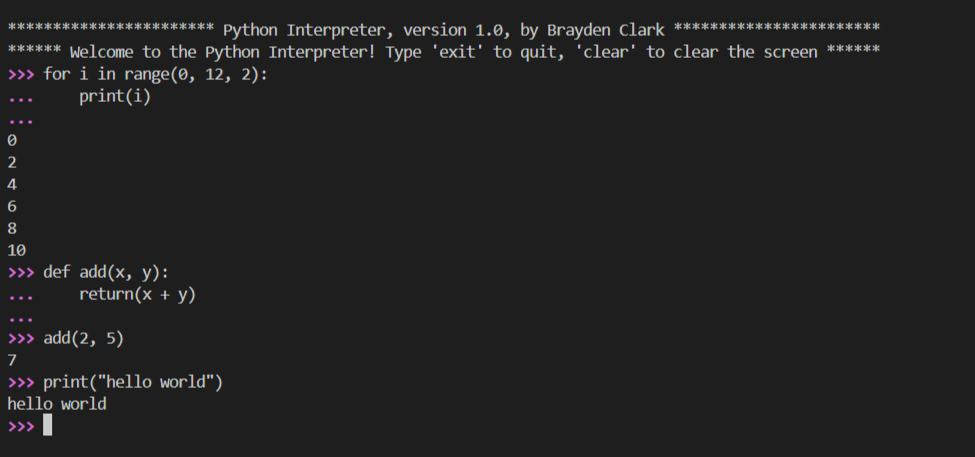

# PyInterp

A small Python interpreter / REPL project with support for interactive input, multiline blocks, command history, and unit testing.

## Project Structure

```text
PythonInterpreter/
├── src/
│   └── pyinterp/
│       ├── __init__.py
│       ├── interpreter.py
│       ├── lexer.py
│       ├── parser.py
│       └── ...
├── tests/
│   ├── test_lexer.py
│   ├── test_parser.py
│   └── test_interpreter.py
├── history/
├── pyproject.toml
└── README.md
```

## Download and Installation

Clone the repository:

```bash
git clone https://github.com/Brad2504/PythonInterpreter.git
cd PythonInterpreter
```

Pip install the package:
```bash
pip install -e .
```

## Usage

To run the code:

```bash
pyinterp
```

To test the code:

```bash
pyinterp -t
```
```bash
pyinterp --test
```



For more usage check tests for examples